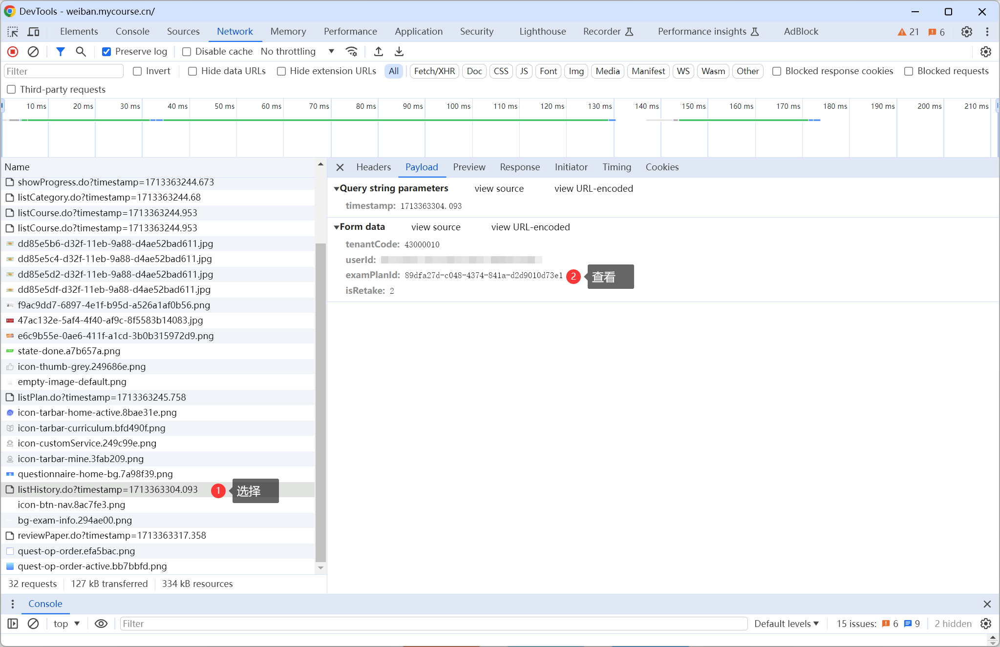

# Weiban-Tool

安全微伴自动考试助手（2024）

**原理：** 每个人题目不一样，但是考过一次就固定，每天题目不一样。通过历史作答获取答案即可一键满分。

## 程序依赖

- Python3: 命令行运行 `python -V`，确认输出版本号为 3 开头
- requests：使用命令 `pip install requests` 安装

## 使用方式

### ① 登录

前往 https://weiban.mycourse.cn/#/login 登录账号

### ② 获取用户 ID 和凭证 token

在浏览器按键盘 F12，进入开发者工具，选择上方选项卡的 **应用 (Application)** 选项，在左侧展开 **本地储存空间 (Local storage)**，点击展开后的项目，再在页面中点击 user 查看它的值。如下图所示：

需要在其中获取信息：

1. 将 `tenantCode` 填入 `安全微课答题助手.py` 的 `tenantCode` 中
2. 将 `userId` 填入 `安全微课答题助手.py` 的 `userId` 中
3. 将 `token` 填入 `安全微课答题助手.py` 的 `x_token` 中

这两个信息格式均为：xxxxxxxx-xxxx-xxxx-xxxx-xxxxxxxxxxxx

### ③ 考一次试

在网页中，启动一次考试，随便乱填后点击提交。

如果**当日**之前已经考过一次，可跳过该步骤，进入下一步骤。如果自己的考试次数已经不足，那就别做了。

### ④ 获取考试项目 ID 和历史考试 ID

**保持浏览器开发者工具开启**，点击进入考试记录界面，再点击一个在**今日**的考试记录，然后进入浏览器开发者工具界面。

在浏览器开发者工具界面，选择 **网络 (Network)** 选项卡，此时在左侧列表底部应该有两个 API 请求记录：listHistory.do 和 reviewPaper.do

首先点击 listHistory.do，再在右侧选择 **荷载 (Payload)** 选项卡，获取以下信息：

- 将 `examPlanId` 填入 `安全微课答题助手.py` 的 `examPlanId` 中

然后点击 reviewPaper.do，再在右侧选择 **荷载 (Payload)** 选项卡，获取以下信息：

- 将 `userExamId` 填入 `安全微课答题助手.py` 的 `userExamId` 中

流程截图如下：

### ⑤ 启动考试，获取用户考试计划 ID

**保持浏览器开发者工具开启**，点击参加考试，确认后进入考试界面。

在浏览器开发者工具界面，选择 **网络 (Network)** 选项卡，此时在左侧列表底部应该有一个 API 请求记录：startPaper.do

点击 startPaper.do，再在右侧选择 **荷载 (Payload)** 选项卡，获取以下信息：

- 将 `userExamPlanId` 填入 `安全微课答题助手.py` 的 `userExamPlanId` 中

### ⑥ 试运行程序

此时所有信息应当已经获取完毕，请确认 `安全微课答题助手.py` 的字段已经**填写完全**。

另外确认脚本中 `final_run = False`.

运行该程序：`python .\安全微课答题助手.py`

确认答案获取比例为 50/50 即 100% 再进行下一步。若此时不是 100%，**不要**正式运行，检查前面操作是否正确。

### ⑦ 正式运行程序

将 `安全微课答题助手.py` 中的 `final_run` 改为 `True`，再运行一遍程序，此次程序将会**正式运行并提交**。

分数为最后一行的 score，正常情况下应该是 100 满分。

## TODO

#1. 登录模块，用户输入学校名称、学号、密码即可直接进行后续操作，无需F12。

#2. 解决第1次作答人工乱填耗费时间的问题，定义一个初始题库，运行相关代码完成第一次考试。
